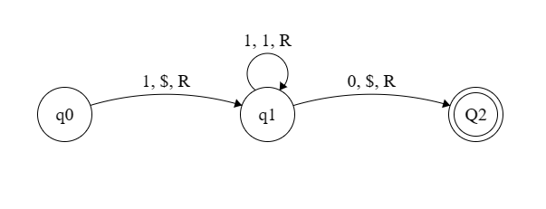

# Turing Machine Interpreter

This is a very small program I developed in Python during class.

I had the idea on how to implement a program that would read turing machine instructions,
and simulate them. It would allow me and my friends to verify our homework, see what went wrong with our instructions, and prepare better for tests.

## Notes
- 0s represent empty spaces
- Accepting states are symbolized with an uppercase Q.
- The file extension should be txt
- The syntax is essential and strict

## How it works
The syntax used to write your instructions is the following:

```
:q0:
1,$,R,1
```

We write the states and the instructions of the program in a .txt file, in the same folder as turing.py

**States**

States are declared within two colons (:).

Between the two colons you declare the state with q#, where # is the identifying number of the state.

If the state is accepting/receiving, use an uppercase *Q*.

The first state is always :q0:


**Instructions**

First things first, instructions for qX, should be written underneath :qX:
```
:q1:
0,$,R,2
```
Each instruction is made up of 4 parts, and their order is essential for the program to work.

Here are the meaning of the instructions of the example above:
1. What we expect to see (0)
2. What to write in that position ($)
3. Which direction to move in the strip (R for Right, L for Left)
4. The number of the state to go to next (2)

Obviously, states can have more than one instruction.

Underneath :qX: should be written all of the instructions belonging to that state (state #X).

If there are more instructions proceeding the instruction, you should add an end statement using a semicolon (;), so the program knows to distinguish between the different instructions.

The last instruction should not have a semicolon as an end statement:
```
:q3:
Y,Y,L,3;
1,1,L,3;
0,0,L,6;
#,#,L,4
```

**Example**

Let's write a simple diagram in the syntax the program understands.

This program takes an unary number (a number that is represented by 1 repeated N times. If the number is 3, the unary representation is 111.) and subtracts from it 1. If the first number was N, the resulting strip would be N-1: 3 (111) would become 2 (11).

In this program I would surround the ending number within two dollar signs ($).

So, the first strip could be:

|-111

for N=3, and the result would be

|-$11$

*Explanation and walkthrough*

Our initial state (state q0) would  replace the first number with a dollar sign.

We see a 1, we write a $, we go right in the strip, and we go to state #1.
```
:q0:
1,$,R,1
```
And basically just by doing that we subtracted 1 from the original number.

Now all we have to do is go to the end of the number, and place another dollar sign after it.


In state #1 we want to continuously move right in our strip until we reach the end of the number.

We would need two instructions for this state.

The first one would be to go right as long as we see a 1. We see a 1, write a 1 (to not change it), go right and stay in the same state (q1 - so we go to state 1).

The second instruction would occur when we see a 0. Recall 0s represent empty spaces, and now it means we reached the end of the unary number, and we want to place a dollar sign where the 0 is.

We see a 0, write a $, go Right (or Left, it doesn't matter in this case), and go to state #2, which is an accepting state.
```
:q1:
1,1,R,1;
0,$,R,2
```

State #2 is accepting and does not take any instructions. Thus, we write it like this:
```
:Q2:
```

And the final program all together would be:
```
:q0:
1,$,R,1
:q1:
1,1,R,1;
0,$,R,2
:Q2:
```